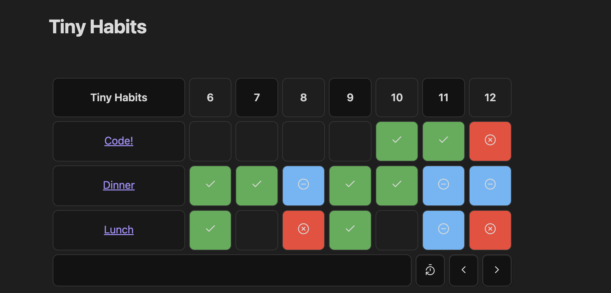

<div id="top"></div>

<!-- PROJECT LOGO -->
<br />
<div align="center">
  <a href="">
    
  </a>

  <h1 align="center">Tiny-Habits</h3>

  <p align="center">
    An Obsidian plugin for keeping track of your habits
    <br />
    <a href="#tiny-habits"><strong>Explore the docs »</strong></a>
    <br />
    <br />
    <a href="">View Demo</a>
    ·
    <a href="https://github.com/nazoadiego/tiny-habits/issues">Report Bug</a>
    ·
    <a href="https://github.com/nazoadiego/tiny-habits/issues">Request Feature</a>
  </p>
</div>

[](https://github.com/nazoadiego/tiny-habits/releases)
[](https://makeapullrequest.com)
[](https://github.com/nazoadiego/tiny-habits/actions/workflows/test.yml)
[](https://github.com/nazoadiego/tiny-habits/actions/workflows/lint.yml)
[](https://www.buymeacoffee.com/nzoadiego)

### Table of Contents

  <ul>
    <li>
      <a href="#tiny-habits">About The Project</a>
    </li>
    <li><a href="#usage">Usage</a></li>
    <li><a href="#options">Options</a></li>
    <li><a href="#how-to-run-it-locally">How to run it locally</a></li>
    <li><a href="#support">Support</a></li>
    <li><a href="#credits">Credits</a></li>
  </ul>


## Tiny Habits

An Obsidian Plugin built with Svelte to track different habits. 

All the entries are stored inside your notes frontmatter. Everything stays local and within your markdown notes.

Features:
- Mark habits as completed, failed, skipped, or not started.
- A table of your habit entries, in the beloved format of a heatmap we see in Github or Anki.
- <a href="#keyboard-support">Keyboard navigation support</a>
- Navigation both to future and past entries.

Preview:



## Usage

- Make a code block with `habits` in the first line
- Open brackets and indicate the folder path. Make sure you write the **full** folder path, otherwise it won't work.
- Create a note in that folder to see the new habit in your habits table.
- Voila!

```habits
{
	"folderPath": "Areas/Habits/Tiny - Morning"
}
```

You can use as many markdown blocks as you like in the same file. And if they get too big, you can collapse them by clicking the table header.

## Keyboard support

You can navigate both with arrows and the hjkl keys. To mark a habit entry, you can do so by focusing on the entry and pressing enter.

## Options

```habits
{
	"folderPath": "Areas/Habits/Tiny - Morning", // the absolute path to the folder containing your habits
	"displayName": "Morning" // (optional) To customize the name that appears in the table
}
```

## How to run it locally

If you are a developer and you wish to run it locally, follow these steps:

- Clone this repo.
- Make sure your NodeJS is at least v16 (`node --version`).
- `pnpm i` to install dependencies.
- `pnpm run dev` to start compilation in watch mode.

### Manually installing the plugin

- Copy over `main.js`, `styles.css`, `manifest.json` to your vault `VaultFolder/.obsidian/plugins/your-plugin-id/`.

### Tests
[](https://github.com/nazoadiego/tiny-habits/actions/workflows/test.yml)

Run with `pnpm run test`

### Linting
[](https://github.com/nazoadiego/tiny-habits/actions/workflows/lint.yml)

Run with `pnpm run lint`

### Making a release

Modify the version in package.json.

```
pnpm run version
git tag -a 0.2.0 -m "0.2.0"
git push origin 0.2.0
```

## Support

If you like the extension feel free to buy me a coffee! https://buymeacoffee.com/nzoadiego

Hope this extension makes your life a little easier.

## Credits

Special thanks to zincplusplus https://github.com/zincplusplus/habit-tracker for the original idea, and an extension that I found so useful it made me wanna build one just like that.

## API Documentation

See https://github.com/obsidianmd/obsidian-api
